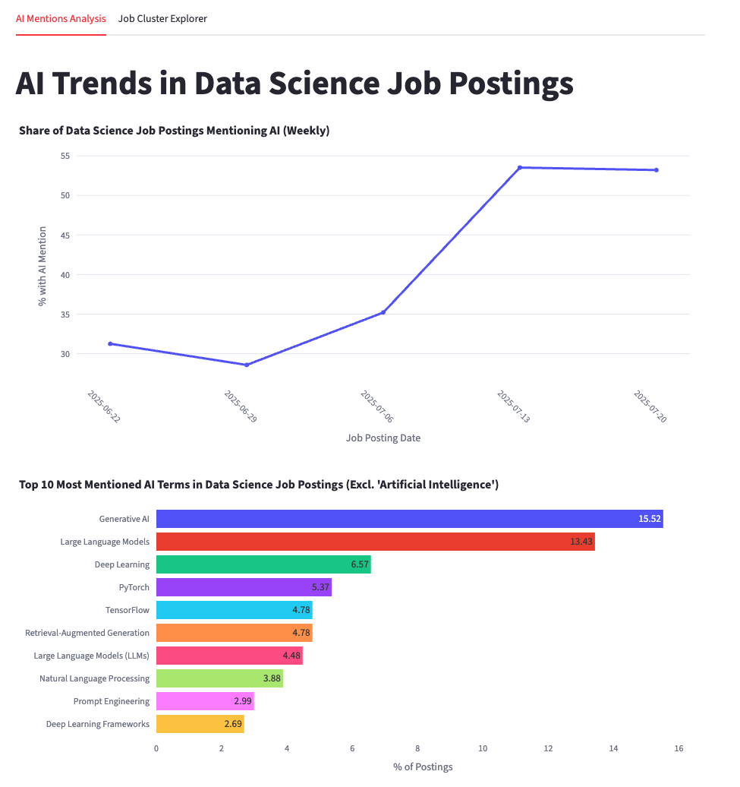
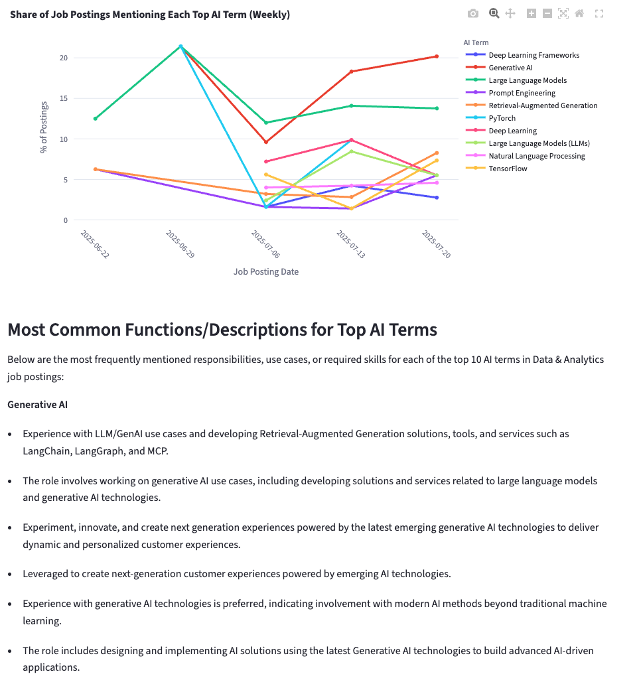
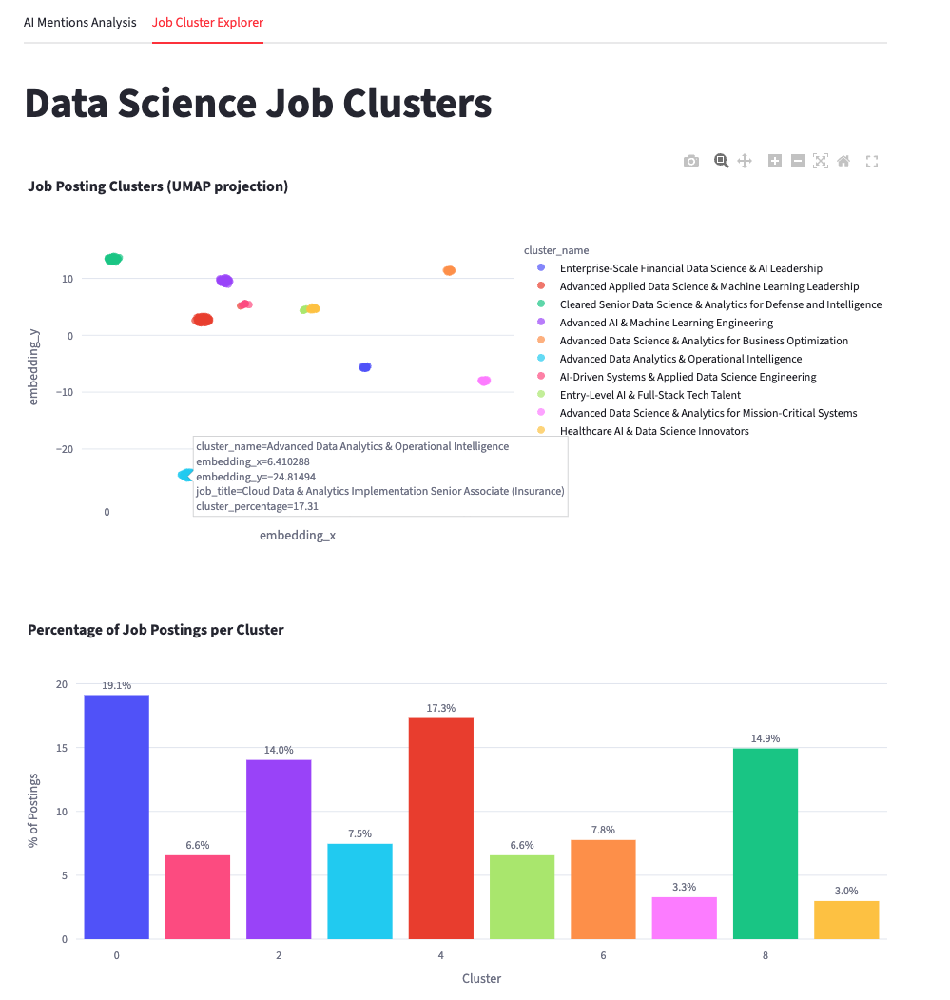
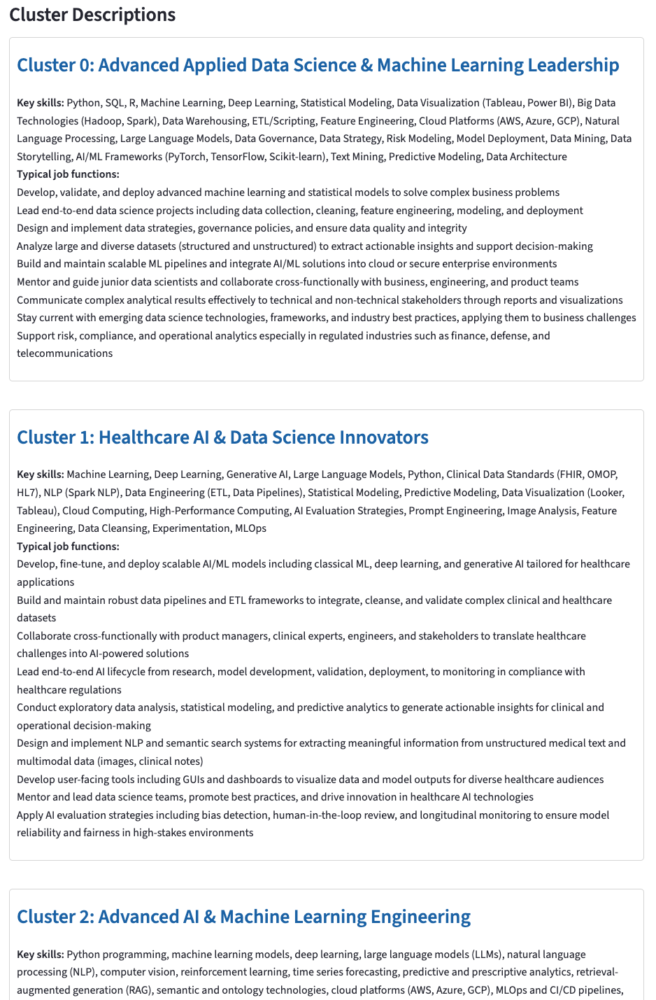

# AI Trends in Data Science Job Postings

Data scientists (and analysts) are facing a new paradigm where the boundaries of our role are shifting rapidly to adapt to the surge of AI technologies. Skills, responsibilities, and expectations are evolving faster than ever, often driven by trends rather than long-term stability. This project aims to provide clarity: to understand how our roles are being reshaped by AI, and to track which AI and data-related skills are surfacing in job postings over time.

In response to this, this repository contains the codebase for **AI Trends in Data Science Job Postings**, a Streamlit app that analyzes the evolution of AI-related terms in job postings for Data Scientist and Data Analyst roles.

The system fetches job postings via the **JSearch API** (RapidAPI), classifies them using an **LLM on OpenRouter** to separate true Data Analyst/Data Scientist positions from other similar but out-of-scope roles (e.g., *Financial Data Analyst*), and enriches them with structured **AI/Data term extraction**. This extraction uses LLM reasoning to detect skills, tools, and keywords related to data and AI in the context of the job’s responsibilities, unifies synonyms, and produces a clean, deduplicated set of terms for analysis.

It is designed with a **GitHub Actions scheduled cron job** so that on the **28th of each month**, job extractions are updated with new credits available from the JSearch API, which resets on that date. This ensures fresh data for subsequent analysis.

---

### 🔗 Live Demo

You can try the live analytics app here:  
**👉 [AI Trends in Data Science – Streamlit App](https://aitrendsds-cukohcfwja8uftb8nzsjka.streamlit.app/)**  
> ⚠️ The app may appear inactive due to sleeping from inactivity.  
> This is intentional, as I avoid abusing empty auto-commits to respect fair usage of the shared Streamlit Cloud space.  
> If you'd like to wake it up to test it, feel free to contact me at: [alexbmeist@gmail.com](mailto:alexbmeist@gmail.com)

---

## What This Project Is (and Is Not)

- ❌ This is **not a generic job scraper**.  
- ✅ It is a **full pipeline for AI term analytics**, from data ingestion to LLM-powered enrichment.  
- ✅ It applies rigorous deduplication and clustering to ensure analytical robustness.  
- ✅ It combines **GenAI reasoning** with deterministic data science techniques.

---

## Folder and File Structure

```
    root/
    │
    ├── streamlit_app.py               ← Streamlit front-end (2 analysis tabs)
    ├── requirements.txt               ← Project dependencies
    │
    ├── .github/workflows/
    │   └── monthly-update.yml          ← GitHub Actions for monthly dataset updates
    │
    ├── data/job_postings_cleaned/      ← Processed datasets (see README in folder)
    │
    ├── utils/
    │   ├── job_fetcher.py              ← API call logic to JSearch (US postings for DS/DA roles)
    │   ├── job_classifier.py           ← LLM-based classification of DS/DA vs. out-of-scope roles
    │   ├── ai_extraction.py            ← LLM-based AI/Data term extraction & normalization
    │   ├── job_pipeline.py             ← Orchestrates fetching, deduplication, classification, enrichment
    │   ├── generate_all_datasets.py    ← Incremental dataset updates + clustering
    │   └── openrouter_wrapper.py       ← OpenRouter + secrets manager wrapper
    │
    ├── learnings/                      ← Notes & technical lessons
    ├── screenshots/                    ← Visual assets for “Visual Preview” section
    └── README.md                       ← This file

```

## 🧠 Data Science Contributions and Highlights

This project is built **from a data science perspective**, with emphasis on robust preprocessing, LLM-assisted enrichment, and interpretable clustering.

Key robustness measures include:

- **Deduplication:** Even if a posting has a unique `job_id`, it is excluded if its combined title and description have ≥ 0.9 cosine similarity (TF-IDF vectorization), preventing near-duplicate jobs from skewing analysis.
- **Embedding and clustering:** New valid jobs are embedded using `all-MiniLM-L6-v2` from Hugging Face. Clusters are assigned using KMeans with optimal *k* selected via silhouette score.  
- **Dimensionality reduction:** UMAP is applied to cluster features for visualization, chosen for its ability to preserve both local and global structure while producing an interpretable 2D projection for the Streamlit explorer.
- **LLM-generated cluster descriptions:** After clustering, each group is described with an LLM to summarize skills, functions, and provide a concise cluster name.

This combination of **semantic enrichment**, **statistical clustering**, and **interpretability** ensures that the insights are both data-driven and meaningful to a human analyst.

---

### 📓 Processing Pipeline Overview

| Step | Script | Purpose |
|------|--------|---------|
| **1. Job fetching** | `job_fetcher.py` | Queries the JSearch API for multiple data science/analytics-related terms in the US. |
| **2. Deduplication** | `job_pipeline.py` | Removes near-duplicate postings using TF-IDF + cosine similarity (threshold ≥ 0.9). |
| **3. Classification (LLM)** | `job_classifier.py` | Uses LLM to flag postings as true Data Analyst/Scientist roles. |
| **4. AI/Data term extraction (LLM)** | `ai_extraction.py` | Extracts and normalizes AI and Data mentions with context-specific explanations. |
| **5. Dataset enrichment** | `job_pipeline.py` | Merges classification and term extraction results. |
| **6. Clustering** | `generate_all_datasets.py` | Embeds postings with Hugging Face (`all-MiniLM-L6-v2`), optimizes *k* via silhouette score, and describes clusters with an LLM. |

---

### 🤖 Role of LLMs (OpenRouter)

LLMs are central to three critical tasks:

1. **Role Classification**  
   - Decides if a job truly fits the Data Analyst/Data Scientist scope.
   - Applies relaxed criteria when the title clearly matches.

2. **AI/Data Term Extraction & Normalization**  
   - Extracts two separate categories:
     - *Data Mentions* (traditional DS/ML/analytics stack).
     - *AI Mentions* (modern AI stack, e.g., LLMs, RAG, prompt engineering).
   - Merges synonyms into a single canonical term.
   - Deduplicates explanations while preserving distinct use cases.

3. **Cluster Description**  
   - Summarizes each cluster’s skills, functions, and assigns a concise, unique name.

These steps are **not feasible with simple keyword rules** — the LLM handles semantic understanding, context-specific filtering, and grouping.

---

### 📊 Clustering Logic

- **Embeddings:** Generated with `all-MiniLM-L6-v2` from Hugging Face (chosen for speed, quality, and OpenRouter not providing embeddings).
- **K selection:** Optimal *k* is found per update batch via silhouette score.
- **Incremental updates:** Only new valid jobs are embedded and clustered, preserving existing cluster IDs.
- **Descriptions:** Each cluster’s name and description are LLM-generated from sample skills & contexts.

---

## Streamlit Deployment

The app (`streamlit_app.py`) has two main tabs:

1. **AI Mentions Analysis**  
   - Share of postings mentioning AI over time.  
     - If fewer than 3 months of data are available, it automatically switches to **weekly aggregation** to provide more temporal variation (less robust but more granular for short series).  
     - Once ≥ 3 months of data are available, it switches to **monthly aggregation** for stability.  
   - Top 10 AI terms (excluding “Artificial Intelligence”).
   - Evolution of each top term over time.
   - Most common responsibilities/descriptions per AI term.
   - All term trends and rankings are shown **in percentages rather than absolute counts**, since the number of postings analyzed is limited by the monthly free quota of the JSearch API.

2. **Job Cluster Explorer**  
   - UMAP visualization of job clusters.
   - Percentage distribution per cluster.
   - LLM-generated cluster descriptions.

### Key Features of the UI

- Interactive Plotly charts.
- Automatic parsing of AI/Data term details.
- Adaptive time binning for trend analysis.
- Last update date shown from dataset metadata.

---

### 🖼️ Visual Preview (In Case Demo is Unavailable)

In case the assistant becomes temporarily inaccessible — for example, if the current OpenAI API key runs out of credits — we include **screenshot previews** of the assistant’s functionality below.

Each screenshot is fully translated into English to illustrate the assistant’s input, reasoning, and output.

---

#### 📸 Screenshot 1 – AI Trends in Data Science Job Postings  



Visualization of global AI mention trends in Data Science job postings.  
- Line chart showing the weekly percentage of postings mentioning AI.  
- Bar chart with the **Top 10 most mentioned AI terms** (percentage of postings)

---

#### 📸 Screenshot 2 – Weekly Trends & Job Functions  



Weekly analysis of the percentage of job postings mentioning each top AI term.  
- Line chart tracking the **temporal evolution** of mentions for terms like Generative AI, LLMs, Prompt Engineering, etc.  
- Description section summarizing the most common responsibilities and use cases for each AI term, providing additional context on how they are applied in roles.  

---
#### 📸 Screenshot 3 – Data Science Job Clusters (UMAP & Distribution)   



Interactive visualization of job posting clusters using **UMAP projection**, where each point represents a posting and its location depends on semantic similarity.  
- Hovering over a point displays a **tooltip** with details such as the cluster name, embedding coordinates, job title, and the percentage of postings in that cluster.  
- The bar chart below shows the **percentage of postings per cluster**.  

---
#### 📸 Screenshot 4 – Job Cluster Descriptions    



View of the job cluster descriptions generated after analyzing and grouping Data Science job postings.  
Each cluster includes:  
- **Key skills** most frequently mentioned.  
- **Typical job functions** associated with that profile.  
This section helps to understand the specialization areas and distinctions within the Data Science job market.  

---

## Environment Configuration (`.env` or Secrets)

This project **always** loads API keys and configuration from a secure secrets system:

- **Local**: `.env` file (loaded via `python-dotenv`).
- **Streamlit Cloud**: `.streamlit/secrets.toml`.
- **GitHub Actions**: `${{ secrets.KEY_NAME }}`.

Required keys:

    OPENROUTER_API_KEY=sk-or-v1-...
    OPENROUTER_BASE_URL=https://openrouter.ai/api/v1
    LLM_MODEL=openai/gpt-4.1-mini
    JSEARCH_API_KEY=xxxxxxxxxxxxxxxxxxxx

---

## Scheduled Updates

A GitHub Actions workflow (`.github/workflows/monthly-update.yml`) runs:

- **Monthly** (on the 28th) — aligned with API credit reset for JSearch.

It executes:

    python utils/generate_all_datasets.py

to run the **entire processing pipeline**: fetching new postings, deduplicating, classifying, extracting AI/Data terms, clustering, and saving the **ready-to-use CSV files** consumed by the app.

---

## Data Outputs

Processed CSVs are stored in `data/job_postings_cleaned/`:

| File | Description |
|------|-------------|
| `data_scientist_us.csv` | Full dataset with classification and enrichment. |
| `data_scientist_us_ai_enriched.csv` | AI/Data mentions for valid jobs. |
| `data_scientist_us_classified.csv` | Binary LLM classification results. |
| `df_result_base.csv` | Incremental base dataset (all valid jobs). |
| `df_result_clusters.csv` | Clustered dataset with embeddings and descriptions. |

See the [`data/job_postings_cleaned/README.md`](data/job_postings_cleaned/README.md) for full details.

---

## Summary

This project is not just about scraping job postings — it’s a **data science system** that:

- Integrates **LLMs via OpenRouter** for semantic classification, AI/Data term extraction, and cluster summarization.
- Uses **Hugging Face embeddings** and **unsupervised learning** for skill clustering.
- Applies **stringent deduplication** to ensure analytical robustness.
- Handles **scheduled updates** aligned with API credit cycles.
- Provides an **interactive analytics dashboard** via Streamlit.

It is an example of how to blend **GenAI reasoning** with **deterministic, reproducible analytics**, making it possible to extract deep insights from unstructured job market data.


